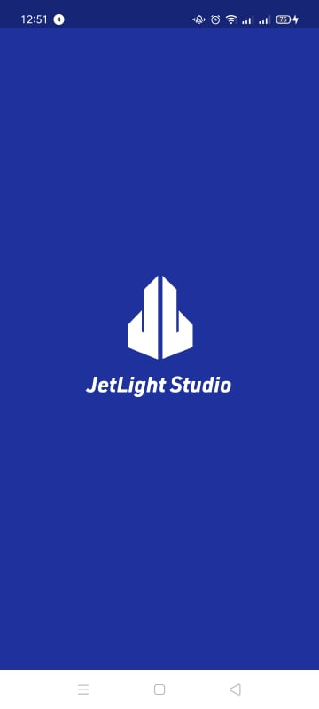
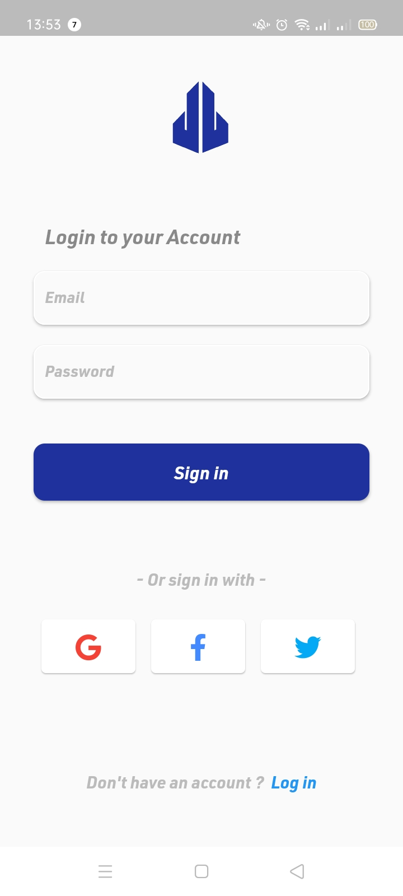
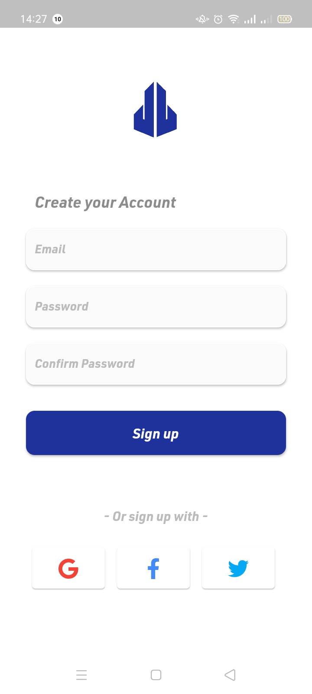

# Authentication-UI-2

## Description:

 Login, Sign up and [splash screen](https://pub.dev/packages/splashscreen) designed with flutter.

## ScreenShots:

  

## Tools & languages:

* Android studio (IDE)
* Dart (logic)
* Flutter (Mobile UI developement kit)
* Paint.net (Image editor)

## Contribution:

Feel free to fork this project and add whatever you like. If you have any suggestions or any comments please feel free to contact me or to open an issue.

## Team:

[Jetlighters](https://github.com/JetLightStudio) having fun.

## Documentation:
* [Install Flutter](https://docs.flutter.dev/get-started/install)
* [Flutter documentation](https://docs.flutter.dev/)

For announcements about new releases and breaking changes, follow the [flutter-announce@googlegroups.com](https://groups.google.com/g/flutter-announce) mailing list.
